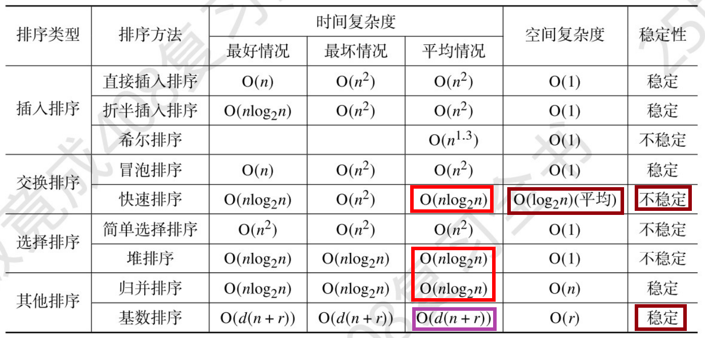

# 排序总结



# 冒泡排序

## 算法原理

在算法的执行过程中，较小的元素像是气泡般慢慢「浮」到数列的顶端，故叫做冒泡排序。

它的工作原理是每次检查相邻两个元素，如果前面的元素与后面的元素满足给定的排序条件，就将相邻两个元素交换。当没有相邻的元素需要交换时，排序就完成了。

经过 i 次扫描后，数列的末尾 i 项必然是最大的 i 项，因此冒泡排序最多需要扫描 n-1 遍数组就能完成排序。

## 代码实现

```java
// 假设数组的大小是 n + 1，冒泡排序从数组下标 1 开始
static void bubble_sort(int[] a, int n) {
    boolean flag = true;
    while (flag) {
        flag = false;
        for (int i = 1; i < n; i++) {
            if (a[i] > a[i + 1]) {
                flag = true;
                int t = a[i];
                a[i] = a[i + 1];
                a[i + 1] = t;
            }
        }
    }
}
```


# 选择排序

从后面选择一个最小或最大的值，放在有序数组末尾


# 直接插入排序

当前值找对应坑位进行插入


# 折半插入排序

找坑位时，通过折半查找的方式来找


# 归并排序

先递归分，再向上merge


# 快速排序

每次选一个元素作为基准值，将数组分成两部分，左边小于基准值，右边大于基准值，然后递归排序左右两部分


# 希尔排序

## 算法原理

希尔排序是插入排序的改进版，处理流程如下：
- 将待排序序列分为若干子序列（每个子序列的元素在原始数组中间距相同）； 
- 对这些子序列进行`直接插入排序`； 
- 减小每个子序列中元素之间的间距，重复上述过程直至间距减少为 1。


# 基数排序

## 算法原理

基数排序将待排序的元素拆分为 k 个关键字，逐一对各个关键字排序后完成对所有元素的排序，分为两种：
- 如果是从第 1 关键字到第 k 关键字顺序进行比较，则该基数排序称为 MSD（最高位优先）基数排序；
- 如果是从第 k 关键字到第 1 关键字顺序进行比较，则该基数排序称为 LSD（最低位优先）基数排序。


## LSD 最低位优先


# 堆排序

堆是一个完全二叉树、堆中每一个节点的值都必须大于等于（或小于等于）其子树中每个节点的值。堆排序的本质是建立在堆上的选择排序。

> 后续介绍都以大顶堆为例

## 建堆

找到最后一个分支节点的根结点，按从右下->左下->上一层右下->上一层左下的顺序调整


## 插入元素

插入到最底部，让新插入的节点与父节点对比大小。如果不满足子节点小于等于父节点的大小关系，我们就互换两个节点。一直重复这个过程，直到父子节点之间满足刚说的那种大小关系。

注意：需要从下往上堆化，再从上往下堆化。例如：从右下角到顶部的点，可能不符合左侧树的堆排序规则，还要继续向下进行堆化。


## 删除元素

删除堆顶元素，把最后一个节点放到堆顶。利用父子节点对比方法。对于不满足父子节点大小关系的，互换两个节点。并且重复进行这个过程，直到父子节点之间满足大小关系为止。


# REFERENCE

- https://oi-wiki.org/basic/heap-sort/