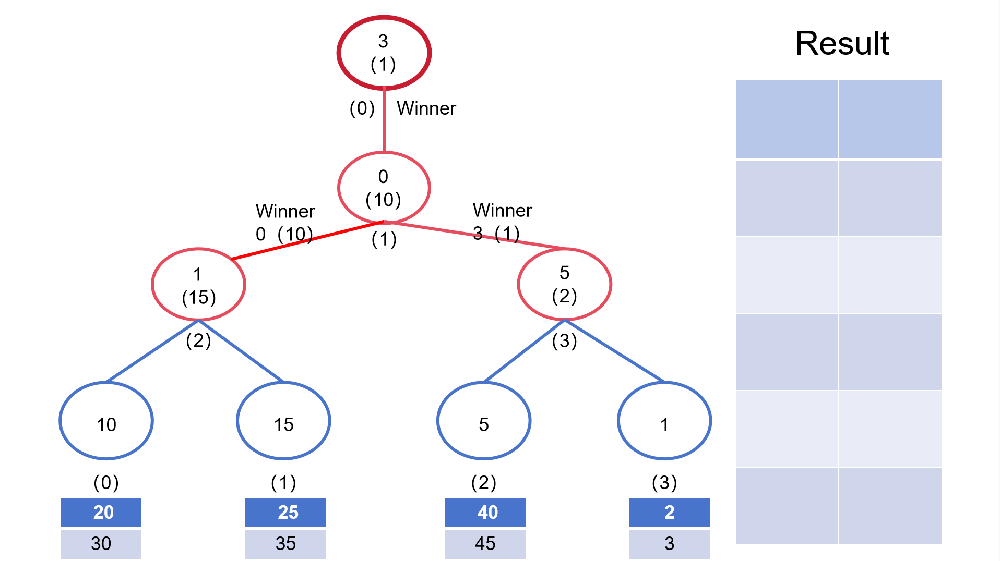

# 基本思想

外部排序指的是大文件的排序，待排序的记录存储在外存储器上，无法一次装入内存，需要在内存和外部存储器之间进行多次数据交换，以达到排序整个文件的目的。

假设待排的记录有m个，内存大小为n，最简单的思想就是，每次从外存中取出n个记录，利用内排序算法排序，再输出到外存中，这样就得到了 ⌊m/n⌋个顺串。两两归并所有顺串，就得到了最终的结果。

但是这种方法明显是低效的。为了减少归并的次数，访问外存的次数，我们可以**减少顺串的数量**，**合理安排归并顺序**，**增加单次归并的顺串数**，通过以下方式实现。

# 置换选择排序

它通过在未排序的元素中选择最小的元素并将其放置在已排序的部分的末尾来逐步将列表排序。步骤如下：

1、首先从初始文件中输入 3 个记录到内存工作区中；从内存工作区中选出关键字最小的记录，将其记为 MINIMAX 记录；然后将 MINIMAX 记录输出到归并段文件中；

2、此时内存工作区中还剩余 2 个记录，若初始文件不为空，则从初始文件中输入下一个记录到内存工作区中并重复以上步骤

3、从内存工作区中的所有比 MINIMAX 值大的记录中选出值最小的关键字的记录，作为新的 MINIMAX 记录；换句话说，若内存区的最小值比归并段最大值还小，则在内存区暂存，例如10（使用败者树或者堆排序实现）

4、直至在内存工作区中选不出新的 MINIMAX 记录为止，即内存区的所有的值都比归并段最后一个值要小，由此就得到了一个初始归并段

5、重复上述操作，直至内存工作为空，由此就可以得到全部的初始归并段

# 败者树

败者树在多个有序数据流进行合并时，`能够迅速确定多个当前元素中的最小（或最大）元素`，并在该最值元素被更新时进行高效调整。该结构维护一个完全二叉树，在非叶子节点（内部节点）中存储一轮比较中的 **败者**，将 **胜者** 推进到下一轮比较（即父节点），显著减少了调整过程中出现的元素比较次数，优化了合并过程的效率。

假设败者为两个元素中较小的一方，当前元素分别为20、10、30、40 ，则败者树的结构如下：

败者树在单次调整过程中子节点只需和对应路径的父节点进行比较。该设计减少了数据更新时的比较次数，提高了操作效率，使其成为解决大规模数据排序和归并问题的有效工具。假设有四个输入序列，分别为{10、20、30}、{15、25、35}、{5、40、45}、{1、2、3}。我们可以使用败者树来合并这些序列，并输出排序后的结果，以下是一个简单的演示动画。

时间复杂度：

败者树是一种特殊的完全二叉树，n个节点的败者树的高度为logn，节点总数为2n-1（完全二叉树），因此构建败者树的时间复杂度为O(n)。

在调整败者树时，由于只需比较和更新对应叶子节点的路径上的节点，无需比较兄弟节点，因此在最坏情况下，单次调整败者树的时间复杂度为O(logn)。

# K路最佳归并树

> k–路平衡归并树是否需要添加虚段：
>
> - 若 (m−1)%(k−1)=0，则不需要增加虚段
> - 否则需加：(k−1) -  (m−1)%(k−1) 个虚段，虚段用0补充

最佳归并树就是通过哈夫曼树的思想来构建k路二叉树，得到最短的带权路径长度WPL，也就是系统磁盘I/O次数的最小值，以此来降低开销

1. 对于减少访问外存的次数的问题，等同于使 k−路归并所构成的 k 叉树的带权路径长度最短。
2. 若使树的带权路径长度 (WPL) 最短，即：构造 哈夫曼树
3. 磁盘 I/O 次数 =WPL∗2

WPL计算示例：

# REFERENCE

- https://blog.csdn.net/icbbm/article/details/133689320
- https://oi-wiki.org/ds/loser-tree/
- https://masterwangzx.com/2019/11/30/outer-sort
- https://juejin.cn/post/7161052095246762021
