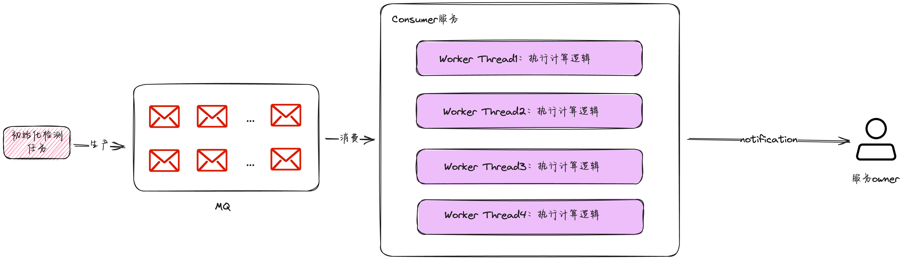
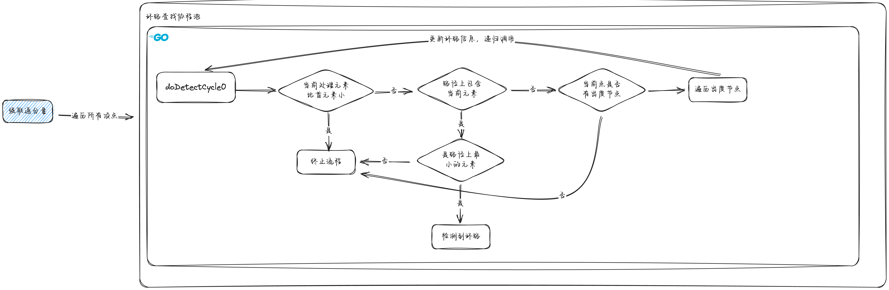
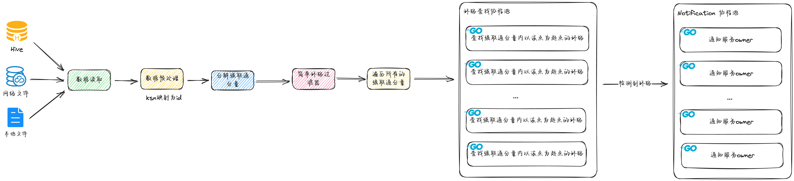
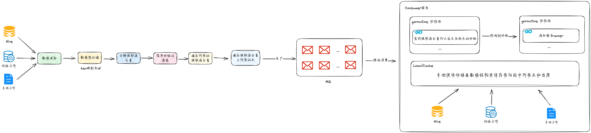

# 背景介绍

## 需求描述

随着公司业务迅猛发展，微服务数量快速增长，微服务间产生了大量复杂的调用关系，形成了一张极为复杂的图。其中，存在几个服务之间调用成环的现象。一旦环上某一个服务出现可用性问题，会拖垮环上所有服务，爆炸半径大，恢复速度慢。

通过neo4j单机图数据库，我们可以在单机上检查调用关系中存在的潜在环路，但是这种方案瓶颈也比较明显，单机的计算能力是有上限的，随着调用关系越来越复杂，计算所需的时间呈指数上涨，系统伸缩能力差。目前调用关系图过于复杂，neo4j图数据库目前只能运行在单机上，无法伸缩，在调用关系图更加复杂，或者希望寻找更复杂的调用环路时力不从心，耗时急剧上升。

## 需求目标

1. 实现一套**分布式、可拓展**的环路检测系统
2. 可以在**天级别**执行完毕所有的检测任务
3. 尽可能找到服务调用**所有环路**

 # 问题分析

本问题不难抽象为在**有向图中检测环路**，其实很容易想到可以通过DFS的方式找到图中的环路，但由于图中节点的关系数据量较大（数十万），单机性能很容易成为瓶颈，因此需要设计一套可拓展的有向图环路检测系统。

说到拓展策略，主要分为垂直拓展和水平拓展两种：

- 水平扩展是通过增加集群中的节点数量来增加系统的容量和性能。在水平扩展中，将新的节点（服务器或虚拟机）添加到集群中，并将负载分布在这些节点上。这样做可以实现负载均衡，从而提高系统的并发处理能力。
- 垂直扩展是通过增加单个节点的计算能力来提高系统性能。在垂直扩展中，通过升级硬件或增加计算资源，例如 CPU、内存或存储容量，来提高单个节点的处理能力。

其实不难发现，我们问题的场景是`计算密集型`，增加CPU和内存资源可以在一定程度上提高检测效率，但并不能解决根本问题，因为本次实现一个分布式环路检测系统，所以至少需要支持水平拓展，否则便没有太大意义了。

通常情况下，一个系统想做拓展，瓶颈主要有两点：集中式组件和高延迟操作

- 集中式组件：比如所有的处理都基于单一的数据库，而单节点DB可能无法支持大规模的服务扩容
- 高延迟操作：例如耗时较高的数据处理任务，这种操作会拖累整体耗时，不论投入多少资源都无济于事

恰好，本需求的原方案就存在这两点问题，解决了这两点问题，一个分布式可拓展的系统便呼之欲出了。

## 数据分布式改造

 当前的卡点主要在单机性能，之所以现在只能单机分析，是因为neo4j社区版不支持集群，根本上来说是数据不支持分布式读写。因此，如果想让整个系统支持分布式，首先就得**对数据进行分布式改造**。有以下几个思路：

| 方案描述                      | 优点                     | 缺点                                                     |
| ----------------------------- | ------------------------ | -------------------------------------------------------- |
| 方案一：使用图数据库集群      | 能够支持数据分布式读写   | 1、对出度层数比较深的情况不友好；2、有一定的学习成本；   |
| 方案二：使用MySQL分库分表存储 | 接入方便，且资源成本较低 | 1、性能较差；2、数据结构不丰富                           |
| 方案三：使用Redis存储         | 性能较好；数据结构丰富； | 暂无明显缺点，全量数据占用内存不到1G，无明显资源成本开销 |

经过方案对比，**使用Redis存储数据在研发接入 & 后续维护 & 功能拓展方便都具有优势**，因此本方案选择使用Redis的Set结构来构建图的邻接表，用于支持环路检测服务进行分布式读取，缓存结构如下：

- 缓存类型：Set
- Key：next_node_set_{node_id}
- Value：[id1, id2.......]

## 计算服务无状态化

通过保持服务器无状态，我们可以轻松实现横向拓展，因为任何服务器都可以处理任何请求。此外，这样还可以增加容错能力，因为如果服务器宕机，不会丢失关键状态。

在本方案的实现上主要表现为系统通过消费计算任务来执行计算逻辑，找到环路即输出或存储，不暂存任何环路的中间状态。

# 核心架构

## 强联通分量分解

直接计算图中所有的环路不失为一种解决办法，实现起来也比较简单，但计算量很大，如果我们可以将问题进行分解，那效率可能会得到成倍的提升。

由图论可知，有向图的环路节点一定在强联通分量上，通过对原图进行拆分，找到图中内所有的强联通分量，再遍历所有的强联通分量找到其中的环路即可。

### Tarjan 算法

常用的找强联通分量的算法有Kosaraju算法和Tarjan算法，算法时间复杂度均为 O(N+M)，但 Trajan 算法不需要构建逆图，效率比Kosaraju算法会好一些，我们选该算法来找图中所有的强联通分量。

> 算法相关介绍可见：https://oi-wiki.org/graph/scc/#tarjan-%E7%AE%97%E6%B3%95

## 并行DFS环路检测算法

如上，我们已经得到了图中所有的强联通分量，遍历所有的强联通分量，依次求每个子图中所有的环即可。此时，**问题其实已经从有向图找所有的环转变为了在强联通分量上找所有的环**。  其实我们不难发现，此时只需要对强联通分量上任意一个点进行DFS即可找到所有的环路，我们称之为单节点DFS。

在检测环路时，需要保证2点：

1. 环路不丢：尽可能多的输出简单环，尽量保证不丢环路
2. 环路不重：1->2->1和2->1->2这两个环路是同一个环路，不应重复输出

 基于以上2点的考虑，本人对单节点DFS做了些改善，设计了一套时间复杂度为O((N + E)*C)的检测算法，同时可以无缝支持系统进行分布式环路检测，整体思路如下：

 

### 相关FAQ

**该算法如何保证最终找的环路不丢不重？**

环路不重：

通过以上算法执行流程不难发现，我们在输出环路时需要保证首元素id最小，其余环路会被剪枝掉，这也保证了我们最终的结果不会重复

环路不丢：

所有的节点均会执行一遍环路检测流程，因此可以保证环路不丢

---

**为什么要改善DFS而不是使用Johnson's Algorithm？**

Johnson's Algorithm 优化了DFS重复计算的问题，但Johnson's Algorithm环路检测算法也是存在一些弊端的，原因如下：

1. 两者时间复杂度相差不大，但改善后的DFS算法实现更简洁：Johnson's Algorithm的和改善后的DFS时间复杂度为O((N + E)*C)，相比改善后的DFS检测算法，Johnson's Algorithm实现起来较为复杂，不利于维护
2. Johnson's Algorithm优势不明显：在小环路检测中，Johnson's Algorithm优势并不明显，而在大环路检测中，Johnson's Algorithm基于单线程同步执行模式，单机执行耗时也会很久。
3. Johnson's Algorithm不利于分布式扩展：改善后的DFS算法可以直接进行分布式拓展，实现横向或纵向的伸缩。而基于Johnson's Algorithm算法思想，如果想并行计算，需要依次摘除节点和节点的入度出度关系，整体流程较为复杂，中间态状态存储空间消耗大，且计算量也比较大。

---

**关于同一环路的无效计算的问题**

本方案在一定程度上存在重复判定路径的问题，例如10→12→13→14→7→10这条环路为例，虽然我们已经剪枝了，但执行到10→12→13→14→7才发现该链路需要剪枝。

该算法的本质其实是空间换时间，通过对所有的点都执行检测算法，可以并行的计算所有的环路。在此过程中，即便是有重复检测，时间复杂度也是O((N + E)*C)级别的，在容忍范围内。而且最终测试，1秒钟可检测100w个环路，相比之下，算法效率并没有受到太大影响。

# 系统处理流程

## 单机流程

> PS：小规模的环路检测直接使用单机算法即可

简单环路过滤器：针对强联通分量上只有1个点和2个点的情况，直接if else逻辑判断环路即可，无需使用协程计算，因为协程调度开销高于简单环路检测开销

为了加快检测速度，我们对每个强联通分量都初始化一个协程去做DFS，针对超大强联通分量的检测，可以使用分布式方案。

## 分布式流程

因为每个节点的计算逻辑之间是没有依赖关系的，所以可以直接分布式计算。分布式架构其实就是把单机的协程计算逻辑做了分布式的部署，遍历强联通分量，将强联通分量上每个一个节点都初始化一个检测任务，投递到MQ中。Consumer消费检测任务，并完成环路检测，可以得到以该点为起点的所有环路。

该分布式方案支持横向纵向拓展，**只需要对Consumer服务扩容或增加服务的Worker线程数即可**，针对大规模的环路检测具有明显优势，可以有效缩减整体的环路检测耗时。

# 测试结果

## 单机测试

测试环境：

| 资源类型 | 资源配额 |
| -------- | -------- |
| CPU      | 2C       |
| 内存     | 2G       |

测试结果：

| 性能指标     | 测试结果                                                     |
| ------------ | ------------------------------------------------------------ |
| 执行效率     | 单机执行效率：**每秒约扫描到150万**个环路                    |
| CPU负载情况  | 2C情况下，峰值CPU利用率为60%左右                             |
| 内存负载情况 | 2G内存情况下，峰值内存使用率为75%（包含JVM内存占用、Infra基础包内存占用） |

## 分布式场景测试

> 扩大Worker线程数后会有更优秀的表现，当前CPU并未打满

测试环境：

| 资源类型 | 资源配额 |
| -------- | -------- |
| CPU      | 2C       |
| 内存     | 4G       |

测试结果：

| 性能指标     | 测试结果                                                     |
| ------------ | ------------------------------------------------------------ |
| 执行效率     | 单机执行效率：**每秒约扫描到20万**个环路                     |
| CPU负载情况  | 2C情况下，峰值CPU利用率仅为2%左右                            |
| 内存负载情况 | 4G内存情况下，峰值内存使用率为27%（包含JVM内存占用、Infra基础包内存占用） |