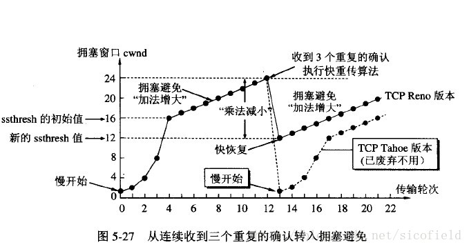

# 各层协议概览

# 数据链路层

> https://juejin.cn/post/7147950339377856526

## PPP协议（广域网）

零填充法：数据中遇到`5个连续的1`，则填充一个0

## CSMA/CD协议

## 重传协议（流量控制与可靠传输）

https://cloud.tencent.com/developer/article/2247789

停止等待协议

回退N帧（GBN）协议

选择重传（SR）协议

# 网络层

## IP协议

IP数据报格式：

- 版本 : 有 4（IPv4）和 6（IPv6）两个值；
- 首部长度 : 值为 1 表示的是 1 个 32 位字的长度，`也就是 4 字节`。因为固定部分长度为 20 字节，因此该值最小为 5。如果可选字段的长度不是 4 字节的整数倍，就用尾部的填充部分来填充。
- 标识 : 在数据报长度过长从而发生分片的情况下，相同数据报的不同分片具有相同的标识符。
- 片偏移 : 和标识符一起，用于发生分片的情况。`片偏移的单位为 8 字节`。

IP数据报分片形式：

## ARP协议

ARP 实现由 IP 地址得到 MAC 地址，每个主机都有一个 ARP 高速缓存，里面有本局域网上的各主机和路由器的 IP 地址到 MAC 地址的映射表。

如果主机 A 知道主机 B 的 IP 地址，但是 ARP 高速缓存中没有该 IP 地址到 MAC 地址的映射，此时主机 A 通过广播的方式发送 ARP 请求分组，主机 B 收到该请求后会发送 ARP 响应分组给主机 A 告知其 MAC 地址，随后主机 A 向其高速缓存中写入主机 B 的 IP 地址到 MAC 地址的映射。

## ICMP协议

ICMP 是为了更有效地转发 IP 数据报和提高交付成功的机会。它封装在 IP 数据报中，但是不属于高层协议。

ICMP 报文分为差错报告报文和询问报文，具体类型如下：

基于ICMP协议的工具主要有ping 和traceroute

- Ping 是 ICMP 的一个重要应用，主要用来测试两台主机之间的连通性。
- Traceroute 是 ICMP 的另一个应用，用来跟踪一个分组从源点到终点的路径。

## NAT协议

## 内部网关协议

### RIP

RIP 是一种基于距离向量的路由选择协议。距离是指跳数，直接相连的路由器跳数为 1。跳数最多为 15，超过 15 表示不可达。

- RIP 协议实现简单，开销小。
- RIP 能使用的最大距离为 15，限制了网络的规模
- 网络出现故障时，要经过比较长的时间才能将此消息传送到所有路由器

### OSFP

开放最短路径优先 OSPF，是为了克服 RIP 的缺点而开发出来的。开放表示 OSPF 不受某一家厂商控制，而是公开发表的；最短路径优先表示使用了 Dijkstra 提出的最短路径算法 SPF。

OSPF 具有以下特点：

- 向本自治系统中的所有路由器发送信息，这种方法是洪泛法。
- 发送的信息就是与相邻路由器的链路状态，链路状态包括与哪些路由器相连以及链路的度量，度量用费用、距离、时延、带宽等来表示。
- 只有当链路状态发生变化时，路由器才会发送信息。
- 所有路由器都具有全网的拓扑结构图，并且是一致的。相比于 RIP，OSPF 的更新过程收敛的很快。

## 外部网关协议

### BGP

# 传输层

## TCP协议

### 三次握手与四次挥手

三次握手：

- SYN
- SNY + ACK
- ACK

四次挥手：

- FIN
- ACK
- FIN + ACK
- ACK

### 重传机制

#### 超时重传（停止等待ARQ协议）

发送方计时器到期前没收到ACK则重传

#### 快速重传（连续ARQ协议）

如果发送方连续收到3次相同的ack就重传，流程如下图所示：发送端收到了三个ack=2的确认，知道了2还没有到，于是就马上重转2。然后，接收端收到了2，此时因为3，4，5都收到了，于是ack回6

### 滑动窗口

### 拥塞控制

> 拥塞控制就是防止过多的数据注入网络中，这样可以使网络中的路由器或链路不致过载。拥塞控制是一个全局性的过程，和流量控制不同，流量控制指点对点通信量的控制。

一个简单的图示以同时看一下各种算法的表现形式：

#### 慢开始与拥塞避免

发送方维持一个叫拥塞窗口cwnd的状态变量，`当收到单个确认但此确认多个数据报的时候就加相应的数值`。所以一次传输轮次之后拥塞窗口就加倍。这就是乘法增长，和后面的拥塞避免算法的加法增长比较。

为了防止cwnd增长过大引起网络拥塞，还需设置一个慢开始门限ssthresh状态变量。ssthresh的用法如下：

- 当cwnd<ssthresh时，使用慢开始算法。
- 当cwnd>ssthresh时，改用拥塞避免算法。
- 当cwnd=ssthresh时，慢开始与拥塞避免算法任意。

无论在慢开始阶段还是拥塞避免阶段，只要发送方判断网络出现拥塞（没有按时收到确认），就要把慢开始门限`ssthresh`设置为出现拥塞时发送方窗口值的一半（但不能小于2）。然后把`拥塞窗口cwnd重新设置为1`，执行慢开始算法。

### 快重传后快恢复

快重传的流程即上述介绍的快速重传，当收到三个重复ACK后，没必要从头开始，而是将sshthresh设置为cwnd的一半，并将cwnd设置为sshthresh，开始执行慢开始算法

- sshthresh = cwnd /2
- cwnd = sshthresh

## UPD协议

## 报文对比

待补充

# 应用层

