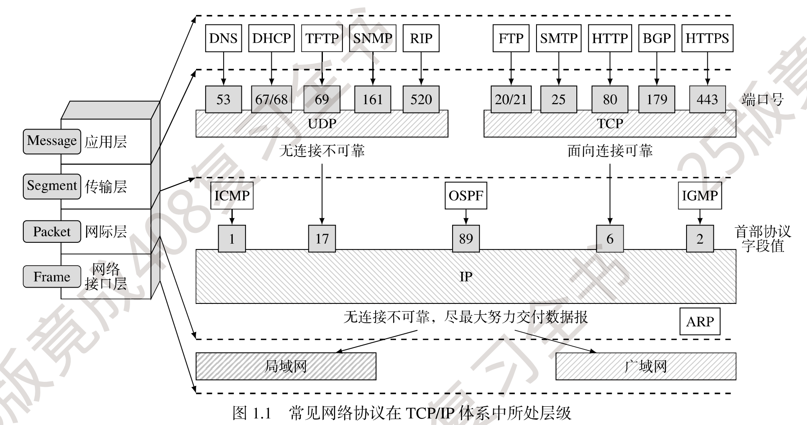
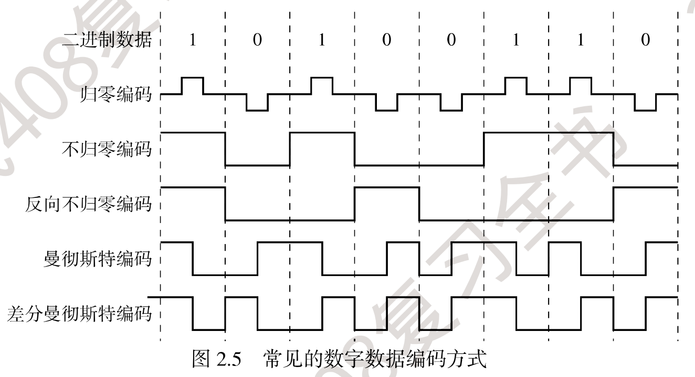
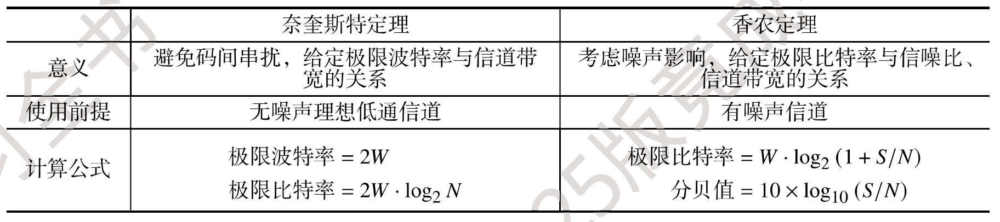
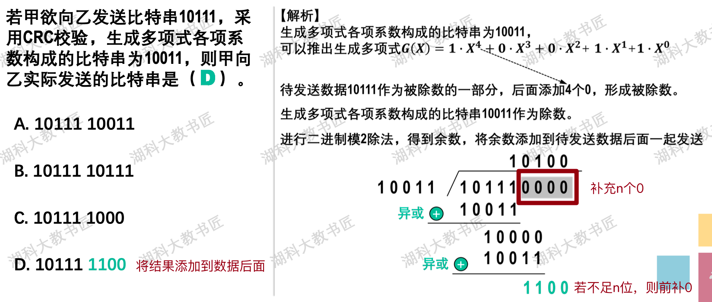

# 整体总结

> 【计算机网络TCP/IP协议-从双绞线到TCP】https://www.bilibili.com/video/BV1ut421374J

## 常见协议

常见协议 & TCP/IP体系所处层级：

## 常见设备

> 参考资料：https://www.bilibili.com/video/BV1LC4y187Ew

总结一句话就是，集线器（hub）和交换机（switch）组成网络，路由器（router）连接这些网络。路由器工作在网络层，要想接入互联网就需要路由器，只在局域网用集线器或者交换机就可以。

- 集线器：无脑转发给所有子网的机器

- 交换机：根据MAC地址区分机器，具有自学习的特点

- 路由器：根据路由表区分机器，可以连接外网，支持NAT

# 物理层

## 编码方式

- 反向不归零编码：信号跳变代表0，不跳变为1
- 曼彻斯特编码：每个时间间隔中间都跳变，向上跳为1或0，向下跳为0或1
- 差分曼彻斯特编码：每个时间间隔中间都跳变，时间起始处跳变为0，不跳为1

## 计算信道传输速率

1、题目直接给出

2、时延带宽积：给出时延 & 时延带宽积

3、奈奎斯特定理 & 香农公式

# 数据链路层

> https://juejin.cn/post/7147950339377856526

## CRC计算

> 参考资料：https://www.bilibili.com/video/BV1V4411Z7VA

异或：两数相同得0，不同得1

## 流量控制 & 可靠传输

- 停止等待协议：方案简单，信道利用率低
  - 发送窗口=1，接收窗口为1

- 回退N帧协议：使用累计确认，按顺序接收，有错则将后续全丢弃，返回最后一个序号的ACK
  - 发送窗口<=2^n-1，接收窗口为1

- 选择重传协议：只需要重传没有ACK的帧
  - 发送窗口 + 接收窗口<=2^n，且接收<=发送，所以接收<=2^(n-1)

# 网络层

# 传输层

# 应用层

