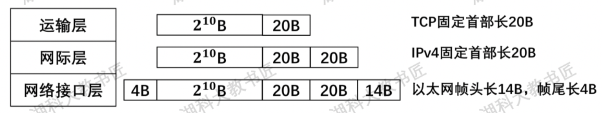
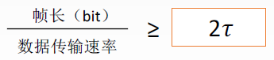
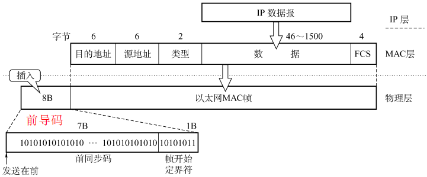
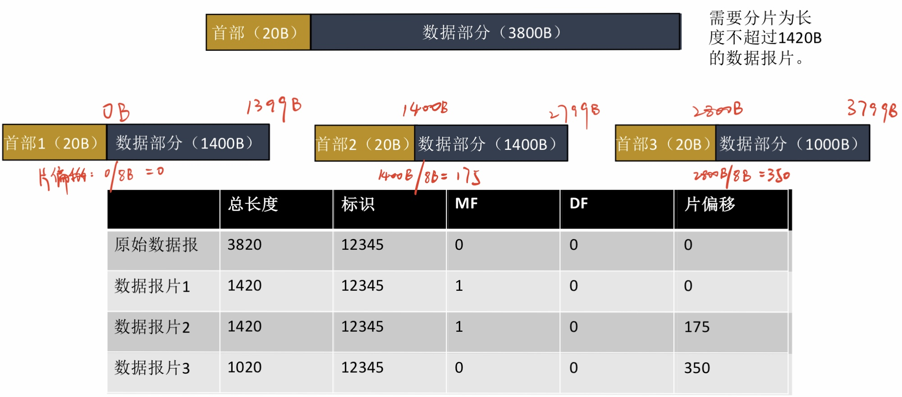
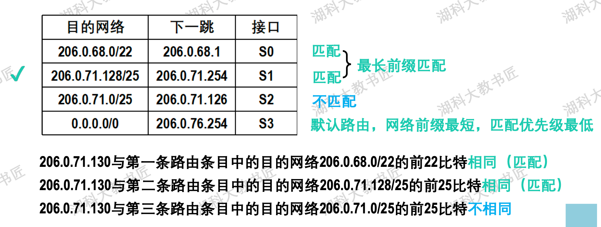
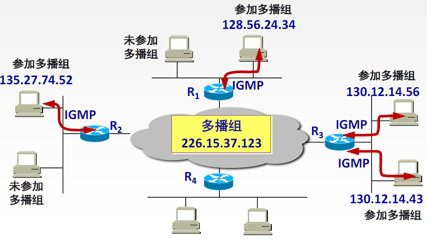

# 整体总结

> 【计算机网络TCP/IP协议-从双绞线到TCP】https://www.bilibili.com/video/BV1ut421374J

## 计网常识

- 100Base-FX传输介质
  - 速率：100Mb/s
  - FX表示光纤，TX表示双绞线
- MAC地址FF-FF-FF-FF-FF-FF为广播地址

## 常见协议

常见协议 & TCP/IP体系所处层级：

## 常见设备

> 参考资料：https://www.bilibili.com/video/BV1LC4y187Ew

总结一句话就是，集线器（hub）和交换机（switch）组成网络，路由器（router）连接这些网络。路由器工作在网络层，要想接入互联网就需要路由器，只在局域网用集线器或者交换机就可以。

- 集线器：无脑转发给所有子网的机器

- 交换机：根据MAC地址区分机器，具有自学习的特点

- 路由器：根据路由表区分机器，可以连接外网，支持NAT

## 网络协议首部

PS：UDP固定首部8B

# 物理层

## 编码方式

- 反向不归零编码：信号跳变代表0，不跳变为1
- 曼彻斯特编码：每个时间间隔中间都跳变，向上跳为1或0，向下跳为0或1
- 差分曼彻斯特编码：每个时间间隔中间都跳变，时间起始处跳变为0，不跳为1

## 计算信道传输速率

1、题目直接给出

2、时延带宽积：给出时延 & 时延带宽积

3、奈奎斯特定理 & 香农公式

## 调制技术

正交振幅调制（QMA）：

例：某通信链路的波特率是1200Baud，采用4个相位，每个相位有4种振幅的QAM（QAM-16）调制技术，则该链路的信息传输速率是多少?

- 码元种类=4X4=16
- 每个码元所包含的比特位：log⁡2(16)=4 (bit)
- 1200Baud = 1200 X 4 = 4800 bit/s

## 信道利用率

传输数据时间 / 总时间

# 数据链路层

> https://juejin.cn/post/7147950339377856526

## CRC计算

> 参考资料：https://www.bilibili.com/video/BV1V4411Z7VA

异或：两数相同得0，不同得1

## 流量控制 & 可靠传输

- 停止等待协议：方案简单，信道利用率低
  - 发送窗口=1，接收窗口为1

- 回退N帧协议：使用累计确认，按顺序接收，有错则将后续全丢弃，返回最后一个序号的ACK
  - 发送窗口<=2^n-1，接收窗口为1

- 选择重传协议：只需要重传没有ACK的帧
  - 发送窗口 + 接收窗口<=2\^n，且接收<=发送，所以接收<=2\^(n-1)

## 介质访问控制

最小帧长 =  总线传播时延 x 数据传输速率 x 2 = 2τ x 数据传输速率

> 以太网规定最短帧长为 64B，凡是长度小于 64B 的都是由于冲突而异常终止的无效帧

## 以太网 MAC 帧

# 网络层

## IP 数据报与分片

**IP数据报格式如下：**

- **协议：**占 8 位，数据部分的协议，即传输层使用的是什么协议

| 协议名 | ICMP | IGMP | TCP   | EGP  | IGP  | UDP    | IPv6 | ESP  | OSPF |
| ------ | ---- | ---- | ----- | ---- | ---- | ------ | ---- | ---- | ---- |
| 字段值 | 1    | 2    | **6** | 8    | 9    | **17** | 41   | 50   | 89   |

**片偏移：**指出较长分组分片后，某片在原分组中的相对位置。**（以 8B 为单位）**

> **最大传输单元MTU：**数据链路层帧可封装数据的上限，以太网的MTU是1500字节
>
> 1500 - MAC帧头16B - MAC帧尾4B - IP固定首部20B = 1420B

## 最长前缀匹配

通过子网掩码对比，优先级为：最长前缀匹配 > 次长匹配 > 默认网关

## IP组播

IP 组播地址让源设备能够将分组发送给一组设备。属于多播组的设备将被分配**一个组播组 IP 地址**（**一群共同需求主机的相同标识**）。组播地址范围为 224.0.0.0 ~ 239.255.255.255（D 类地址），一个 D 类地址表示一个组播组。只能作为分组的**目标地址**。源地址总是为**单播地址**

1. 组播数据报也是 “尽最大努力交付”，不提供可靠传输，应用于 UDP
2. 对组播数据报不产生 ICMP 差错报文
3. 并非所有 D 类地址都可以作为组播地址

IGMP 协议让路由器知道本局域网上**是否有主机（的进程）参加或退出了某个组播组**，只知道有无，不知道数量

- 某主机要加入组播组时，该主机向组播组的组播地址发送一个 IGMP 报文，声明自己要成为该组的成员。本地组播路由器收到 IGMP 报文后，要利用组播路由选择协议把这组成员关系发给因特网上的其他组播路由器。
- 本地组播路由器周期性探询本地局域网上的主机，以便知道这些主机是否还是组播组的成员。只要有一个主机对某个组响应，那么组播路由器就认为这个组是活跃的；如果经过几次探询后没有发现一个主机响应，组播路由器就认为本网络上没有此组组播的主机，因此就不再把这组的成员关系发给其他的组播路由器。

## 移动IP

移动 IP 技术是移动结点（计算机 / 服务器等）以**固定的网络 IP 地址**，实现跨越不同网段的**漫游**功能，并保证了基于网络 IP 的网络权限在漫游过程中不发生任何改变

# 传输层

# 应用层

