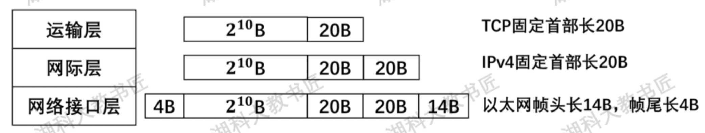
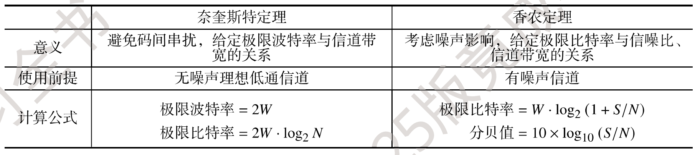
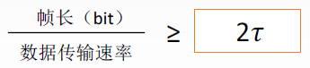
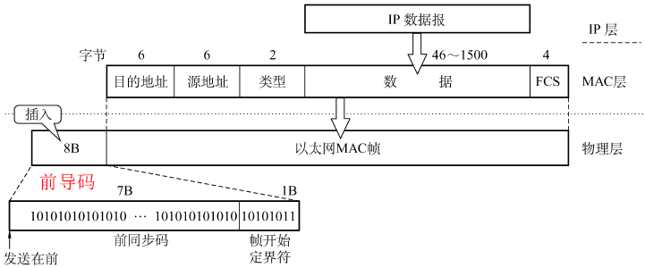
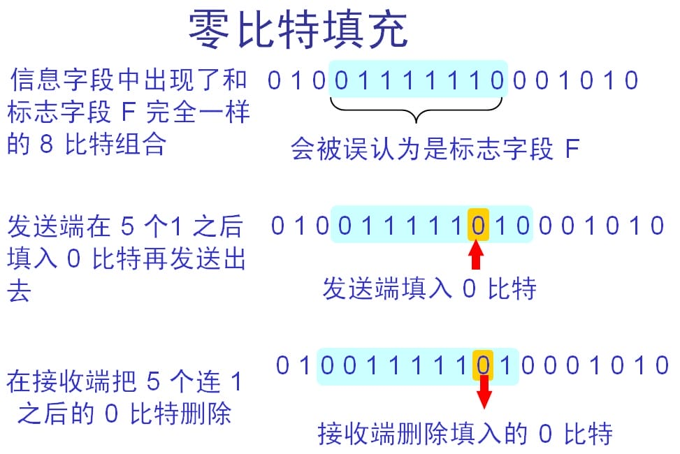
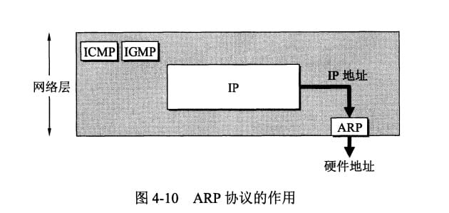
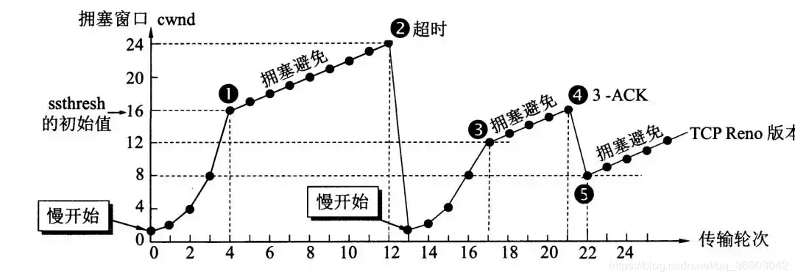

# 整体总结

> 【计算机网络TCP/IP协议-从双绞线到TCP】https://www.bilibili.com/video/BV1ut421374J

## 计网常识

- 100Base-FX传输介质
  - 速率：100Mb/s
  - FX表示光纤，TX表示双绞线
- MAC地址FF-FF-FF-FF-FF-FF为广播地址

## 分层模型

全局上理解 `7层协议，4层，5层`的对应关系

各层功能：

## 常见协议

常见协议 & TCP/IP体系所处层级：

## 常见设备

> 参考资料：https://www.bilibili.com/video/BV1LC4y187Ew

总结一句话就是，集线器（hub）和交换机（switch）组成网络，路由器（router）连接这些网络。路由器工作在网络层，要想接入互联网就需要路由器，只在局域网用集线器或者交换机就可以。

- 集线器：无脑转发给所有子网的机器

- 交换机：根据MAC地址区分机器，具有自学习的特点

- 路由器：根据路由表区分机器，可以连接外网，支持NAT

## 网络协议首部

PS：UDP固定首部8B

# 物理层

## 编码方式

- 反向不归零编码：信号跳变代表0，不跳变为1
- 曼彻斯特编码：每个时间间隔中间都跳变，向上跳为1或0，向下跳为0或1
- 差分曼彻斯特编码：每个时间间隔中间都跳变，时间起始处跳变为0，不跳为1

## 计算信道传输速率

1、题目直接给出

2、时延带宽积：给出时延 & 时延带宽积

3、奈奎斯特定理 & 香农公式

## 调制技术

正交振幅调制（QMA）：

例：某通信链路的波特率是1200Baud，采用4个相位，每个相位有4种振幅的QAM（QAM-16）调制技术，则该链路的信息传输速率是多少?

- 码元种类=4X4=16
- 每个码元所包含的比特位：log⁡2(16)=4 (bit)
- 1200Baud = 1200 X 4 = 4800 bit/s

## 信道利用率

传输数据时间 / 总时间

# 数据链路层

> https://juejin.cn/post/7147950339377856526

## CRC计算

> 参考资料：https://www.bilibili.com/video/BV1V4411Z7VA

异或：两数相同得0，不同得1

## 流量控制 & 可靠传输

- 停止等待协议：方案简单，信道利用率低
  - 发送窗口=1，接收窗口为1

- 回退N帧协议：使用累计确认，按顺序接收，有错则将后续全丢弃，返回最后一个序号的ACK
  - 发送窗口<=2^n-1，接收窗口为1

- 选择重传协议：只需要重传没有ACK的帧
  - 发送窗口 + 接收窗口<=2^n，且接收<=发送，所以接收<=2^(n-1)

## 介质访问控制

最小帧长 =  总线传播时延 x 数据传输速率 x 2 = 2τ x 数据传输速率

> 以太网规定最短帧长为 64B，凡是长度小于 64B 的都是由于冲突而异常终止的无效帧

## 以太网 MAC 帧

## PPP协议（广域网）

零填充法：数据中遇到`5个连续的1`，则填充一个0

# 网络层

通过子网掩码对比，优先级为：最长前缀匹配 > 次长匹配 > 默认网关

## IP协议

IP数据报格式：

- 版本 : 有 4（IPv4）和 6（IPv6）两个值；
- 首部长度 : 值为 1 表示的是 1 个 32 位字的长度，`也就是 4 字节`。因为固定部分长度为 20 字节，因此该值最小为 5。如果可选字段的长度不是 4 字节的整数倍，就用尾部的填充部分来填充。
- 标识 : 在数据报长度过长从而发生分片的情况下，相同数据报的不同分片具有相同的标识符。
- 片偏移 : 和标识符一起，用于发生分片的情况。`片偏移的单位为 8 字节`。

IP数据报分片形式：

> 片偏移的值为当前数据报开头在原数据报范围内的字节序/8

### IPV6协议

#### IPv6 & IPv4 区别：

- IPv6 将地址从 32 位（4B）扩大到 **128为（16B）**，更大的地址空间

- IPv6 将 IPv4 的**校验和字段彻底移除**，以减少每跳的处理时间
- IPv6 将 IPv4 的可选字段移出首部，变成了**扩展首部**，成为灵活的首部格式，路由器通常不对扩展首部进行检查，大大提高了路由器的处理效率
- IPv6 支持**即插即用**（即自动配置），不需要 DHCP 协议
- IPv6 首部长度必须是 **8B 的整数倍**，IPv4 首部是 4B 的整数倍
- IPv6 **只能在主机处分片**，IPv4 可以在路由器和主机处分片
- ICMPv6：附加报文类型 “分组过大”
- IPv6 支持资源的预分配，支持实时视像等要求，保证一定的带宽和时延的应用
- IPv6 取消了协议字段，改成下一个首部字段
- IPv6 取消了总长度字段，改用有效载荷长度字段
- IPv6 取消了服务类型字段

#### IPV6地址压缩

**压缩形式：**4BF5:0000:0000:0000:BA5F:039A:000A:2176

- 4BF5:0:0:0:BA5F:39A:A:2176

**零压缩：**一连串连续的 0 可以被一对冒号取代，但**双冒号表示法在一个地址中仅可出现一次**，否则可能有歧义

## IP 数据报与分片

**IP数据报格式如下：**

- **协议：**占 8 位，数据部分的协议，即传输层使用的是什么协议

| 协议名 | ICMP | IGMP | TCP   | EGP  | IGP  | UDP    | IPv6 | ESP  | OSPF |
| ------ | ---- | ---- | ----- | ---- | ---- | ------ | ---- | ---- | ---- |
| 字段值 | 1    | 2    | **6** | 8    | 9    | **17** | 41   | 50   | 89   |

**片偏移：**指出较长分组分片后，某片在原分组中的相对位置。**（以 8B 为单位）**

> **最大传输单元MTU：**数据链路层帧可封装数据的上限，以太网的MTU是1500字节
>
> 1500 - MAC帧头16B - MAC帧尾4B - IP固定首部20B = 1420B

## 最长前缀匹配

通过子网掩码对比，优先级为：最长前缀匹配 > 次长匹配 > 默认网关

## IP组播

IP 组播地址让源设备能够将分组发送给一组设备。属于多播组的设备将被分配**一个组播组 IP 地址**（**一群共同需求主机的相同标识**）。组播地址范围为 224.0.0.0 ~ 239.255.255.255（D 类地址），一个 D 类地址表示一个组播组。只能作为分组的**目标地址**。源地址总是为**单播地址**

1. 组播数据报也是 “尽最大努力交付”，不提供可靠传输，应用于 UDP
2. 对组播数据报不产生 ICMP 差错报文
3. 并非所有 D 类地址都可以作为组播地址

IGMP 协议让路由器知道本局域网上**是否有主机（的进程）参加或退出了某个组播组**，只知道有无，不知道数量

- 某主机要加入组播组时，该主机向组播组的组播地址发送一个 IGMP 报文，声明自己要成为该组的成员。本地组播路由器收到 IGMP 报文后，要利用组播路由选择协议把这组成员关系发给因特网上的其他组播路由器。
- 本地组播路由器周期性探询本地局域网上的主机，以便知道这些主机是否还是组播组的成员。只要有一个主机对某个组响应，那么组播路由器就认为这个组是活跃的；如果经过几次探询后没有发现一个主机响应，组播路由器就认为本网络上没有此组组播的主机，因此就不再把这组的成员关系发给其他的组播路由器。

## 移动IP

移动 IP 技术是移动结点（计算机 / 服务器等）以**固定的网络 IP 地址**，实现跨越不同网段的**漫游**功能，并保证了基于网络 IP 的网络权限在漫游过程中不发生任何改变

## ARP协议

ARP 实现由 IP 地址得到 MAC 地址，每个主机都有一个 ARP 高速缓存，里面有本局域网上的各主机和路由器的 IP 地址到 MAC 地址的映射表。

> APR请求报文是广播，响应报文是单播

如果主机 A 知道主机 B 的 IP 地址，但是 ARP 高速缓存中没有该 IP 地址到 MAC 地址的映射，此时主机 A 通过广播的方式发送 ARP 请求分组，主机 B 收到该请求后会发送 ARP 响应分组给主机 A 告知其 MAC 地址，随后主机 A 向其高速缓存中写入主机 B 的 IP 地址到 MAC 地址的映射。

## DHCP协议

**获取 IP 地址的方法有两种：**

- 静态配置：管理员手动分配 IP 地址
- 动态配置：通过 DHCP 服务器自动分配 IP 地址

> 动态主机配置协议 DHCP 是**应用层**协议，使用 **客户/服务器** 方式，客户端与服务端通过**广播**方式进行交互，基于 `UDP`。

## ICMP协议

> ICMP 是为了更有效地转发 IP 数据报和提高交付成功的机会。它封装在 IP 数据报中，但是不属于高层协议。

ICMP 报文分为差错报告报文和询问报文，差错报告报文具体类型如下：

1. **终点不可达**：当路由器或主机不能交付数据报时就向源点发送终点不可达报文。（**无法交付**）
2. **源点抑制**：当路由器或主机由于拥塞而丢弃数据报时，就向源点发送源点抑制报文，使源点知道应当把数据报发送速率放慢。（**拥塞丢数据，目前已不使用**）
3. **时间超过**：当路由器你手动生存时间 TTL=0 的数据报时，除丢弃数据报外，还要向源点发送时间超过报文。当终点在预先规定的时间内不能收到一个数据报的全部数据报片时，就把已收到的数据报片都丢弃，并向源点发送时间超过报文。（**TTL = 0**）
4. **参数问题**：当路由器或目的主机收到数据报的首部中有的字段的值不正确时，就丢弃该数据报，并向源点发送参数问题报文。（**首部字段有问题**）
5. **改变路由（重定向）**：路由器把改变路由报文发送给主机，让主机知道下次应将数据发送给另外的路由器。（**值得更好的路由**）

**基于ICMP协议的工具主要有 Ping 和 Traceroute：**

- Ping 是 ICMP 的一个重要应用，主要用来测试两台主机之间的连通性。
- Traceroute 是 ICMP 的另一个应用，用来跟踪一个分组从源点到终点的路径。

**不应发送 ICMP 差错报文的情况：**

- 对具有**组播地址**的数据都不发送 ICMP 差错报告报文
- 对具有**特殊地址**（0.0.0.0 或 127.0.0.0）的数据不发送 ICMP 差错报告报文

## NAT协议

对于私有IP地址是不能在网络上传输的，需要通过 NAT技术来实现私网IP和公网通信的功能。网络地址转换 NAT（Network Address Translation）：在专用网连接到因特网的路由器上安装 NAT 软件，安装了 NAT 软件的路由器交**NAT路由器**，它至少有一个有效的**外部全球 IP地址**。

## 路由协议

> OSPF协议向本自治系统中的所有路由器发送信息，这种方法是洪泛法。
>
> RIP协议收敛慢，OSPF协议收敛相对比较快

**三种路由协议比较：**

# 传输层

## TCP协议

### 三次握手与四次挥手

三次握手：

四次挥手：

### 重传机制

#### 超时重传（停止等待ARQ协议）

发送方计时器到期前没收到ACK则重传

#### 快速重传（连续ARQ协议）

如果发送方连续收到3次相同的ack就重传，流程如下图所示：发送端收到了三个ack=2的确认，知道了2还没有到，于是就马上重转2。然后，接收端收到了2，此时因为3，4，5都收到了，于是ack回6

### 流量控制

**流量控制：**让**发送方慢点**，要让接收方来得及接收，TCP 利用**滑动窗口**机制来实现流量控制

在通信过程中，接收方根据自己**接收缓存的大小**，动态地调整发送方的发送窗口大小，即接收窗口rwnd（接收方设置确认报文段的**窗口字段**来将rwnd通知给发送方），**发送方的发送窗口 = Min（接收窗口 rwnd，拥塞窗口 cwnd）**

**例：**A 向 B 发送数据，连接建立时，B 告诉 A：“我的 rwnd = 400B”，设每一个报文段 100B，报文段序号初始值为 1

### 拥塞控制

> 拥塞控制就是防止过多的数据注入网络中，这样可以使网络中的路由器或链路不致过载。拥塞控制是一个全局性的过程，和流量控制不同，流量控制指点对点通信量的控制。

一个简单的图示以同时看一下各种算法的表现形式：

#### 慢开始与拥塞避免

发送方维持一个叫拥塞窗口cwnd的状态变量，`当收到单个确认但此确认多个数据报的时候就加相应的数值`。所以一次传输轮次之后拥塞窗口就加倍。这就是乘法增长，和后面的拥塞避免算法的加法增长比较。

为了防止cwnd增长过大引起网络拥塞，还需设置一个慢开始门限ssthresh状态变量。ssthresh的用法如下：

- 当cwnd<ssthresh时，使用慢开始算法。
- 当cwnd>ssthresh时，改用拥塞避免算法。
- 当cwnd=ssthresh时，慢开始与拥塞避免算法任意。

无论在慢开始阶段还是拥塞避免阶段，只要发送方判断网络出现拥塞（没有按时收到确认），就要把慢开始门限`ssthresh`设置为出现拥塞时发送方窗口值的一半（但不能小于2）。然后把`拥塞窗口cwnd重新设置为1`，执行慢开始算法。

#### 快重传后快恢复

快重传的流程即上述介绍的快速重传，当收到三个重复ACK后，没必要从头开始，而是将sshthresh设置为cwnd的一半，并将cwnd设置为sshthresh，开始执行慢开始算法

- sshthresh = cwnd /2
- cwnd = sshthresh

## UPD协议

UDP首部校验：

- 源IP地址：4B
- 目的IP地址：4B
- UDP长度：2B
- 协议号：17->1B
- 额外空间：1B

## 报文对比

TCP 固定首部为20B

UDP 首部开销很小8B，UPD数据报格式如下：

# 应用层

常见协议 & 熟知端口号

| 协议        | 传输层协议 | 端口号 |
| ----------- | ---------- | ------ |
| HTTP        | TCP        | 80     |
| HTTPS       | TCP        | 443    |
| FTP（控制） | TCP        | 21     |
| FTP（数据） | TCP        | 20     |
| SMTP        | TCP        | 25     |
| POP3        | TCP        | 110    |
| IMAP        | TCP        | 143    |
| Telnet      | TCP        | 23     |
| DNS         | UDP        | 53     |
| DHCP        | UDP        | 67     |
| TFTP        | UDP        | 69     |

## DNS协议

> **DNS 作用：**域名 -> IP 地址

递归查询流程：

迭代查询流程：

## HTTP协议

HTTP 协议定义了浏览器（万维网客户进程）怎样向万维网服务器请求万维网文档（**请求**），以及服务器怎样把文档传送给浏览器（**响应**）

HTTP报文的Keep-Alive表示是否为持续连接，若为false则每次传输完都要断开连接，持续连接流程如下：

## 邮件协议

SMTP & POP3协议共同配合：先S后破，全部TC

SMTP（25端口）不能给用户发邮件，且只能发7比特ASCII码，MIME丰富了SMPT协议，将非ASCII码数据通过MIME转为ASCII码

## FTP协议

FTP 使用 TCP 实现可靠传输

- 数据端口：20
- 控制端口：21

是否使用 TCP 20 端口建立数据连接与传输模式有关

- **主动**方式使用 TCP 20 端口
  - 客户发送连接请求时，服务器主动从 20 端口和客户端建立连接
- **被动**方式由服务器和客户端自行协商决定（端口 > 1024）
  - 客户端发送连接请求时，给服务端发送一个端口请求，服务端返回一个端口，客户端通过该端口连接

