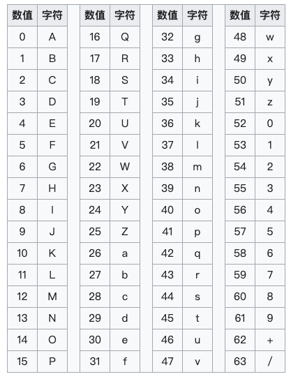

# 什么是Base64编码

Base64编码，是由64个字符组成编码集：26个大写字母A-Z，26个小写字母a-z，10个数字0~9，符号“+”与符号“/”。通过对原二进制进行Base64编码，我们可以实现将一组二进制数据映射为字符串。

```python
base64EncodeChars = 'ABCDEFGHIJKLMNOPQRSTUVWXYZabcdefghijklmnopqrstuvwxyz0123456789+/'
```

# Base64编码的应用

与所有二进制到文本编码方案一样，Base64 旨在跨仅可靠支持文本内容的通道传输以二进制格式存储的数据。主要有以下应用场景：

1. 二进制数据存储：将文件或其他二进制数据转为文本，并存储为文本格式，例如URL、Cookie、网页传输少量二进制文件、在数据库中存储图片、存储Protobuf对象
2. 用于发送电子邮件附件：电子邮件刚问世的时候，只能传输英文，但后来随着用户的增加，中文、日文等文字的用户也有需求，但这些字符并不能被服务器或网关有效处理，Base64可以解决这个问题

# Base64编码的原理

Base64编码的基本思路是将原始数据的`三个字节拆分`转化为`四个字节`，然后根据Base64的对应表，得到对应的编码数据。当原始数据凑不够三个字节时，编码结果中会使用额外的符号`=`来表示这种情况。Base64索引表如下图所示：



编码 `Man` 的Base64结果为`TWFu`，Base64编码计算过程如下：

```markdown
文      本：M        		a        		n
ASCII 编码：77       		97       		110
8bit  字节：01001101 		01100001 		01101110
6bit  字节：010011 		010110 		000101 		101110
Base64索引：19     		22     		5      		46
Base64编码：T      		W      		F      		u
```

## 为什么字符末尾有==？

编码前字节数正好`被3整除`，转化为`二进制ASCII 编码`（ `3*8=24` ）后，正好`可以被6整除`。若`编码前字节数不能被3整除`，最后`会余出1个或2个字节`，那么编码时需要：

- 使用 000000 字节值在末尾补足，使其字节数能够被3整除；
- 编码时`补位的6个比特位单元`用 `=` 表示。

## 为什么Base64编码后开销变大？

> 相对于原始二进制数据的大小，Base64 编码会导致 33-37% 的开销

因为6和8的最大公倍数是24，所以3个8比特的字节刚好可以拆分成4个6比特的字节。计算机中，因为一个字节需要8个存储单元存储，所以我们要把6个比特往前面补两位0，补足8个比特，补足后所需的存储单元为32个，是原来所需的24个的4/3倍。而插入的换行符最多可增加 4%的空间

# 附录

RFC：https://www.rfc-editor.org/rfc/rfc4648

Wiki：https://en.wikipedia.org/wiki/Base64


